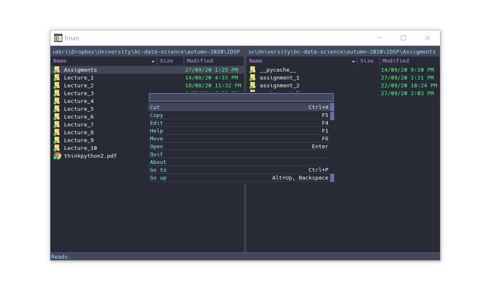

# Dracula for [fman](https://fman.io/)

> A dark theme for [fman](https://fman.io/).

## Install

All instructions can be found at [draculatheme.com/fman](https://draculatheme.com/fman).

## Team

This theme is maintained by the following person(s) and a bunch of [awesome contributors](https://github.com/dracula/template/graphs/contributors).

|  |
| ------------------------------------------------------------------------------------------------------------------ |
| [Sabrina Pereira](https://github.com/sf-pear)       

## License

[MIT License](./LICENSE)
